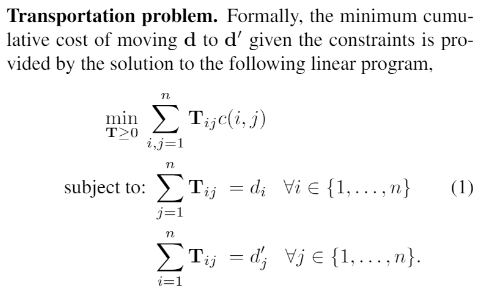
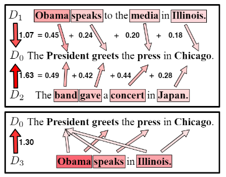
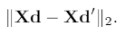
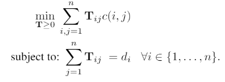
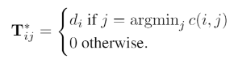

# [From Word Embeddings To Document Distances](https://github.com/lytinahome/Paper-collection/blob/master/Documentation%20Distance/2.From%2BWord%2BEmbeddings%2BTo%2BDocument%2BDistances.pdf)
Author: Matt J. Kusner et al.

### The problem it wants to solve and the conclusion.
+ The paper defined a new distance function **Word Mover's Distance (WMD)** between text documents. This distance metric can be used in knn algorithm so that to solve the document classification problem.
+ For the distance function, it has the following features:
   - it takes into account the word frequency(by BOW); word sentiment (by word2vec); paper structure (by adding penalty term).
   - it depends on a preselected word embedding. 
   - the calculation of the distance can be treated as an instance of Earth Moever's Distance, there exists the fast specialized solution for this problem, see [Pele & Werman, 2009](https://github.com/lytinahome/Paper-collection/blob/master/Documentation%20Distance/Fast%20and%20Robust%20Earth%20Mover%E2%80%99s%20Distances.pdf).
   - it is highly interpreted as the distance between document can be breakdown to the distance between word.
   - it doesn't need the hyperparameter.
   - it shows better-performence/high-retrieval-accuracy than BOW, TF-IDF, LDA and LSI.
+ For the knn implemation, it has the following features:
   - it derived two types of the lower bound of WMD: WCD and RWMD.
   - proposed **prefetch and prune** method based on the two lower bounds above to accelarate the knn calculation.
   - under the **prefetch and prune** framework, it also provide an approximate knn result to get the result even faster. (the hyparameter cutoff m is needed, the emprical best choice will be k~2k).
   
### A scenario to implement this method.
document classification by knn.

### What is the method.
#### Distance function
Define:
+ word embedding matrix **X**, dim = (a, n)
+ the normalized BOW vector of one document **d**, dim = (1, n), high sparse, exclude the stop words.
+ word traval cost c(i, j) = ||xi -xj||_2, indicate the distance between the word i and word j
+ Traval flow matrix **T**, dim = (n, n), non-negative entry, indicates the transferring from d to d', our optimization target.

the math form of the distance is 

this is an instance of Earth Moever's Distance *TODO: add a link*, there exists the fast specialized solution for this problem, see [Pele & Werman, 2009](https://github.com/lytinahome/Paper-collection/blob/master/Documentation%20Distance/Fast%20and%20Robust%20Earth%20Mover%E2%80%99s%20Distances.pdf). The average time complexity is O(n^3 log n).

Final example

### Fast calculation in knn -- Prefetch and Prune
Define two lower bounds of WMD:
+ Word centroid distance (WCD):

the time complexity of calculation O(an). 
+ Relexed word mioving distance (RWMD):
reduce the WMD to the following question.

the solution is 

the time complexity of calculation O(n^2)

+ how to select the nearest k neighbours fast:
   1. rank the documents by WCD
   2. select top k, calculate their WMD as the best-so-far
   3. calculate the RWMD of the rest in order for pruning.
   4. for the one survives, calculate its WMD and update best-so-far as needed.

+ how to select the approximate nearest k neighbours fast:
   1. rank the documents by WCD, **only keep top m document, discard the rest.**
   2. select top k, calculate their WMD as the best-so-far
   3. calculate the RWMD of the rest in order for pruning.
   4. for the one survives, calculate its WMD and update best-so-far as needed.

### Ideas learn from the paper
+ construct lower bound for pruning purpose.
+ filter first by simple LB then by complex LB.

### Limitation of this paper
includes the limitation of word embedding. (无法处理多语义问题)
   
### Some take aways from the paper
+ BOW and TF-IDF:  
  - they has some limitation when applying them to document classification: 1) they only consider word frequency. 2) near-orthogonality betweent the represent vector. 3) not consider the distance between single words. 
+ LSI and LDA
  - Advantage: 1) both are learning a latent low-dimensional representation of documents. 2) more coherent documentation representation than BOW/TD-IDF.
  - they has some limitation when applying them to document classification: 1) hard to scale to large dataset *pending: reason?* 2) still performed poorly in document classification *pending: reason? maybe in Mikolov's paper.*
  - google word embedding performs best in this method.
  
### Code and related work
+ [Code](https://github.com/mkusner/wmd)
+ [word embedding 1](https://github.com/lytinahome/Paper-collection/blob/master/Documentation%20Distance/Efficient%20Estimation%20of%20Word%20Representations%20in%20vector%20space.pdf)
+ [word embedding 2](https://github.com/lytinahome/Paper-collection/blob/master/Documentation%20Distance/Distributed%20Representations%20of%20Words%20and%20Phrases.pdf)
