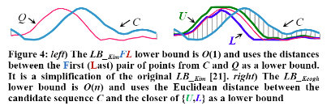
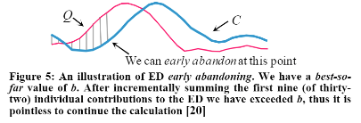
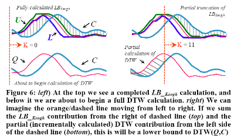
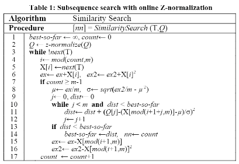
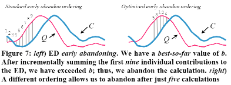
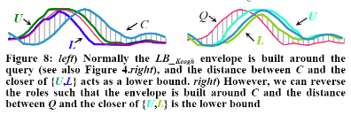
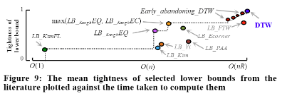

# [Searching and Mining Trillions of Time Series Subsequence under Dynamic Time Warping](https://github.com/lytinahome/Paper-collection/blob/master/Time%20Series%20Similarity/1.Searching%2Band%2BMining%2BTrillions%2Bof%2BTime%2BSeries%2BSubsequences%2Bunder%2BDynamic%2BTime%2BWarping.pdf)
Author: Thanawin Rakthnmanon et al. 
### The problem it wants to solve and the conclusion. 
- Solved the problem of **Search on sequential data**: Find the closest subsequence to the target in a massive data file (up to trillion), the distance can be defined by DTW (Dynamic Time Warping) or ED (Euclidean Distance).
- The paper proposed **UCR-DTW** method to solve the problem above. And...
  - It is a fast exact search method (not approximate search).
  - It is better than index-based methods and other state-out-of-art method. 
  - The same idea works for both streaming data, and batch offline search.
  - no parameter is needed; no preprocessing is needed; no query length limitation.
- DTW is still good for real-time problems and large scale problem.

### A scenario to implement this method.
- **gene problems**: (see section 5.3 in the paper) 
> Set a relative short piece of DNA (with the length of 0.7million) in Human as the target, then use UCR-DTW to find out the closest gene piece (from a 2 billion long DNA query) in other five primates respectively. After that cluster those six DNA pieces. It turns out the clustering relationship reflects the correct biological grouping info. This is an example of how UCR-DTW is used in similary search and further in time series clustering.

### What is this method.
The main idea of this method is to pruning the sequences and filtering out the candidate in order to reduce the needed calculation. 

Below are some Existing tricks:
  + using squared distance 
> this one is intuitive.
  + using lowering bounding 

> use the lower bound to preprune the candidate subsequence. It is mainly for accelerating DTW. There are many types of lower bounds, the key idea of keogh LB is define a envelop of the target sequece. 
  + early abandoning of ED and LB_keogh

> abandon the candidate when it exceed the best-so-far LB in halfway.
  + early abandoning of DTW

> abandon the candidate when its DTW[1:k] + LB[k+1:] exceed the best-so-far.
 
Below are some Novel tricks -- called **UCR suite**:
  + early abandoning of Z-normalization

> using a sliding window to normalize the data and calculate the distance. Be careful of the accumulated floating error, need to refresh every millions. 
  + reodering early abandoning

> optimize the ordering to accelerate the early abandoning process.
  + reversing the query/data role in LB_keogh
  

> envelope the candidate (LB_EC) instead of target (LB_EQ) when calculating the lower bound, when all other lower bounds fail to prune. in fact, the operation won't use overhead space and save time overall. Note that LB_EC doesn't equal to LB_EQ.
  + cascading lower bounds

> there is a trade-off between time complexity and tightness of the lower bound. in pactice we will use all effective LB to prune the data.

**The order of the prunings to consider**:
1. Early Abandoning of ED and LB; Z-normalization; reordering. Those steps can be done incrementaly and simutanously. Using different type of LB.
2. Early Abandoning of LB_keoghEC
3. Early Abandoning of DTW.

### Ideas learned from this paper
0. z-normalization is prerequisite for the similarity comparision.
1. The idea of lower bound is important. 1) use lower bound for pruning. 2) compare the time complexity and tightness of lower bound to evaluate the effitiveness of the lower bound.
2. accumulated floating-point error can be profound if you did more than millions operation.
3. DTW is an ubiquitous metric but it has limitation itself.

### Limitation of this paper
the limitation of this paper is mainly about the limitation of the DTW itself. refer to: [DTW limitation](https://www.ques10.com/p/26994/what-are-the-limitation-of-dtw/#:~:text=)

### Some take aways from the paper
+ similarity search is core subroutine in many data mining algorithm.
+ DTW is an ubiquitious distance metrics for sequential data. It outperforms in many dataset.
+ ED is a special case of DTW.
+ Normalization is important in the similarity search. in this paper, we use the mean-variance normalization. Each subsequence needs to be normalized individually. 
+ Indexing can help in the search problem but index method has the limitation on large scale problem (the key is each subseq needs to normalized). 
+ other interesting topic in time series: motif dicovery, anomaly detection, clustering, and classification.
### code and related work.
+ [code](http://www.cs.ucr.edu/~eamonn/UCRsuite.html)
+ [The DTW project](https://dynamictimewarping.github.io/)
+ [Indexing](https://github.com/lytinahome/Paper-collection/blob/master/Time%20Series%20Similarity/Exact%20index%20of%20DTW.pdf)
+ [An overview of sequential data method](https://github.com/lytinahome/Paper-collection/blob/master/Time%20Series%20Similarity/Overview_Experimental_comparison_time_series.pdf)
+ [Fast subsequence matching](https://github.com/lytinahome/Paper-collection/blob/master/Time%20Series%20Similarity/fast%20subsequence%20matching%20in%20ts%20data.pdf)
 
